# Raytracing in One Weekend
## vec3 class

We create a class that defines a 3-D points. We use the same class for vectors and colour (r,g,b) values since we write less code by doing this. Nonetheless, we create aliases `point3` and `color3` to make the code more readable.

## Rays, camera and background

### Ray definition
We need to define the notion of a ray and what colour is seen along that ray.

A ray is of the form $P(t)=A+tb$. A is the origin point, b is the direction vector. For t > 0, we get points along P(t) in front of A, for negative t, we get values behind A.

The ray class is defined to store the origin and direction vector, and be able to compute `P(t)` 

### Sending rays into a scene

A raytracer sends rays through pixels, and computes the color seen in the direction of these rays. 
Works in these 3 steps:
	- Send rays from 'eye' (camera) through the pixel
	- Determine which objects the ray intersects
	- Compute the color of the closest intersection point

We need to set up pixel dimensions for our image. So lets say we desire our image to have an aspect ratio of 16:9. This means the width : height ratio is 16:9. We can define a width, then use aspect ratio to calculate height, which we ensure is > 1.

We also need to define a viewport, which is a virtual rectangle in 3-D space that contains a grid of all image pixel positions. 

Finally, we set the camera centre to be at point (0,0,0), the x-axis to be to the right, y-axis up, and negative z-axis towards the viewing direction.

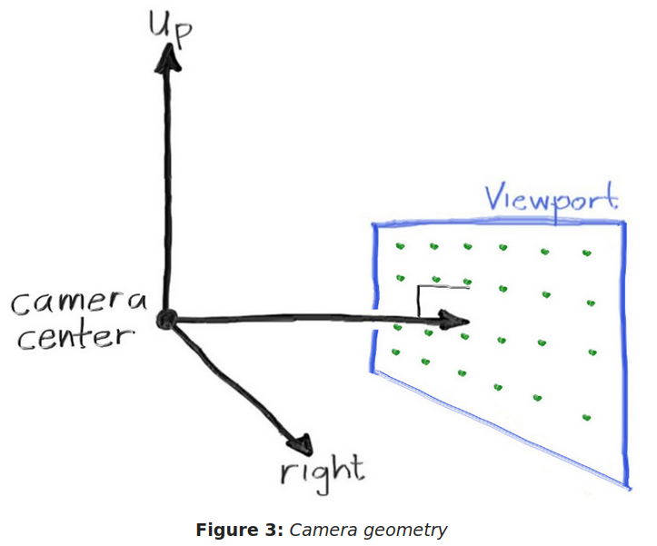

Remember that we want to render the image from the zeroth pixel in the top-left corner, then move row by row until we render the pixel in the bottom-right corner. This means that the y-axis is increasing going down, which doesn't follow the convention we have defined above. We define a vector `V_u` which runs from the left to the right, and another vector `V_v` which runs from the top to the bottom. We also calculate pixel deltas. 

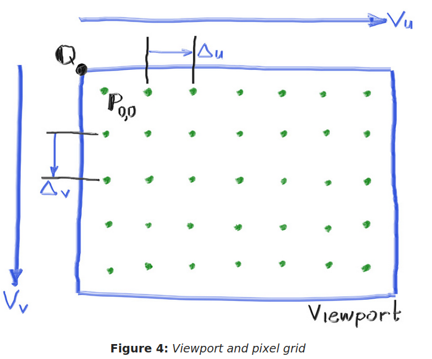

To render a sky-like scene, we need to render a gradient that blends white and blue, based on the height of the y-coordinate, after making the ray direction a unit-vector.

We use linear interpolation to blend blue and white. 

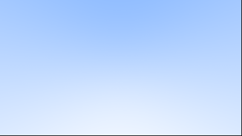
*Blue to white gradient based on y-coordinate of ray*

## Adding spheres

The equation of a sphere is $x^2+y^2+z^2=r^2$. This can also be interpreted as saying that if a point (x,y,z) is on a sphere, then $x^2+y^2+z^2=r^2$, if the point is in the sphere then $x^2+y^2+z^2<r^2$ if $x^2+y^2+z^2>r^2$

If we choose the centre of the sphere to be some arbitrary point $(C_{x}, C_{y}, C_{z})$ then the equation becomes: $(x-C_{x})^2+(y-C_{y})^2+(z-C_{z})^2=r^2$ which isn't nice to work with.

Let's represent this with vectors. Notice that the vector from the centre $C$ to a point $P$ is $P-C$. The dot product of this vector with itself is: $(P-C).(P-C)=(x-C_{x})^2+(y-C_{y})^2+(z-C_{z})^2$

For our purposes, we want to know whether our ray $P(t)$ hits the sphere at any point. So we want to find all $t$ which satisfy:
$$(P(t)-C).(P(t)-C)=r^2$$
We replace $t$ with its expanded form and solve for $t$
$$(tb+(A-C)).(tb+(A-C))=r^2$$
$$t^2b.b + 2tb.(A-C)+(A-C).(A-C)-r^2=0$$
This is a quadratic we can solve. Number of roots tells us about intersection of ray with sphere.

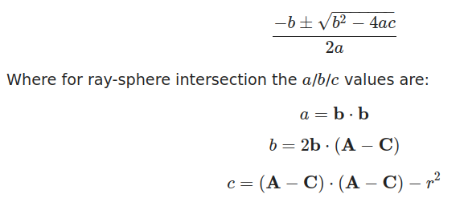

0 roots => no intersection
1 root => 1 intersection
2 roots => 2 intersections (we'll need to find the closest one to the camera)

Based on this, we can write a function which receives a ray, a sphere centre and radius, then based on the determinant, tells us whether the ray hits the sphere. We can check for this in the `ray_color` function, and have it return some color if there's is a hit. So it colours pixels that correspond to a sphere we have defined in some arbitrary centre with arbitrary radius.

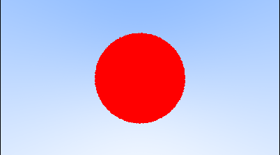
*Our first raytraced image*

## Surface normals and multiple objects
### Shading with surface normals

First, we decide whether to make surface normals unit length, since we will be needing them in many places, therefore we don't have to keep recalculating them each time we need them. We can sometimes be more efficient with how we generate these normals (not having to square root) by taking advantage of the specific geometry we are working with. For example, sphere surface normals can be made unit length by just dividing them by the radius. 

We define the normal pointing outward to be in the direction of the hit point minus the centre.

We can visualise these normals using a color map on the sphere. We know these will be of unit length (between -1 and 1), so we scale each x,y,z component to be between 0 and 1, then return those as rgb values. 

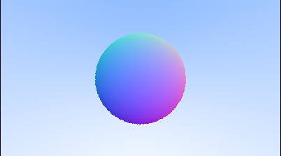
*Shading the sphere with surface normals*

### Front faces vs back faces

Currently, our surface normals always point outwards from the surface of the object they hit. We could also change this convention, to having the rays always point against the ray. This is important because later, we will need to work out whether the ray is intersecting the object from the outside, or from the inside.

If the ray is always outward, then we can tell whether the ray intersects from the outside by doing a dot product with the surface normal, and checking whether it is negative.  

### Hittable list abstraction

We create a class that represents a list of things that can be hit. We create a hit function which goes through the vector of `hittable` objects and returns a boolean for whether or not we hit anything. There's also a hit record passed by reference, which at the end should contain the surface normal, hit point, and t of the closest object to the camera.

The ray color function now looks like this

```C++
color ray_color(ray& r, const hittable& world){
	hit_record rec;
	
	if(world.hit(r, interval(0, infinity), rec)){
		return 0.5*(rec.normal + color(1,1,1));
	}
	
	vec3 unit_direction = unit_vector(r.direction());
	auto a = 0.5*(unit_direction.y() + 1.0);
	return (1.0-a)*color(1.0, 1.0, 1.0) + a*color(0.5, 0.7, 1.0);
}
```

If we have hit anything, the `rec` variable will contain information about it's normal vector, which we use to shade it. 

If we've hit nothing, we render the sky.

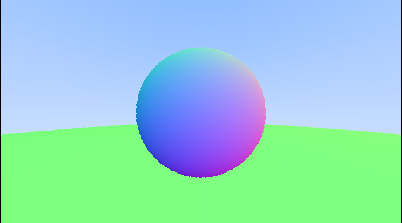

## Anti aliasing

When we zoom into the image, we notice the edges are have this staircase effect. We are doing point sampling on each pixel, which is why we get this. We can mitigate this by averaging the color over surrounding areas of a pixel.

We modify the code to take into account the number of samples taken per pixel, such that we average out the samples before writing the color to the `ppm` file.

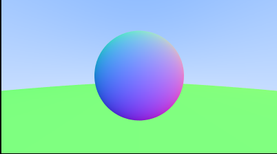
*Anti-aliasing to produce smooth edges*

## Diffuse materials

### Simple diffuse materials

Diffuse materials that don't emit their own light take on the color of their surroundings, but modulate it with their own intrinsic color. When rays hit a diffuse material, they bounce off into random directions. Note that they may be absorbed instead of reflected - the more rays an object absorbs, the darker it is.

The simplest diffuse material is one which directs a ray in any direction away from the surface with equal probability. 
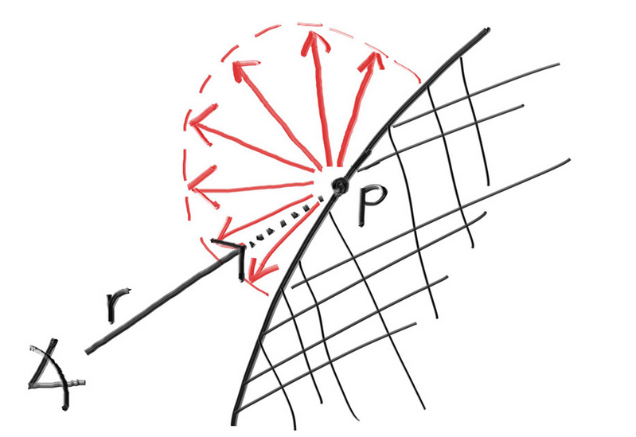


We need to add functionality to generate arbitrary vectors:

```C++
vec3 random_vec(){return vec3(double_random(), double_random(), double_random());}

vec3 random_vec(double min, double max){return vec3(double_random(min, max), double_random(min, max), double_random(min, max));}
```

We need to produce vectors in a that are within a hemisphere (See picture above.)
The analytical methods for doing this are tricky and quite involved, so we use a simpler method - keep generating samples until you get good samples.

Steps taken to generate random vectors within unit sphere:
1. Generate random point within unit cube, and reject it if it isn't in unit sphere 
2. Normalise vector within unit sphere 
3. Invert vector if in wrong hemisphere

If a ray keeps 100% of its color, then the object is white, if it keeps 0% of its color, then the object is black. In the demo, we have a recursive call to ray color, where we pass a ray whose origin is the hit point, in the direction of the random vector in the hemisphere. We multiply that function call with 0.5, so we want the ray to keep 50% of its color, we expect grey spheres.

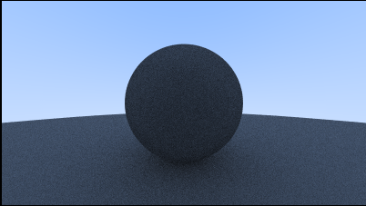
*Matte material grey*

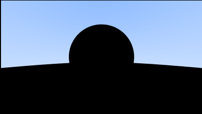
*Matte material black*
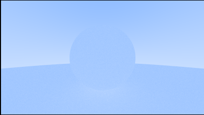
*Matte white takes on color of surroundings*


